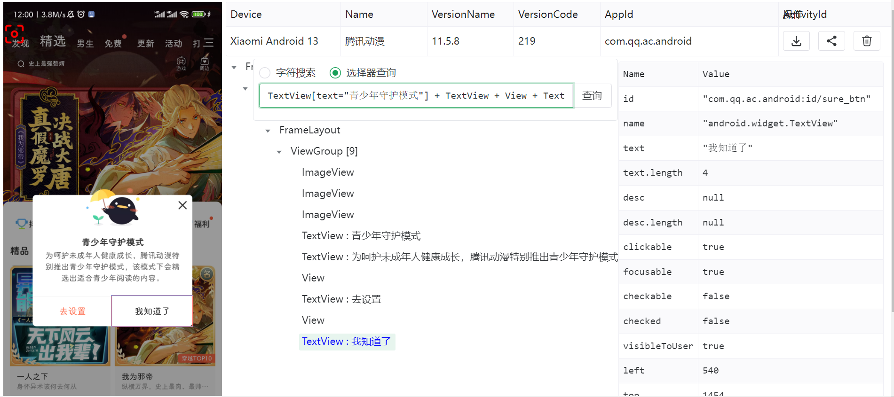
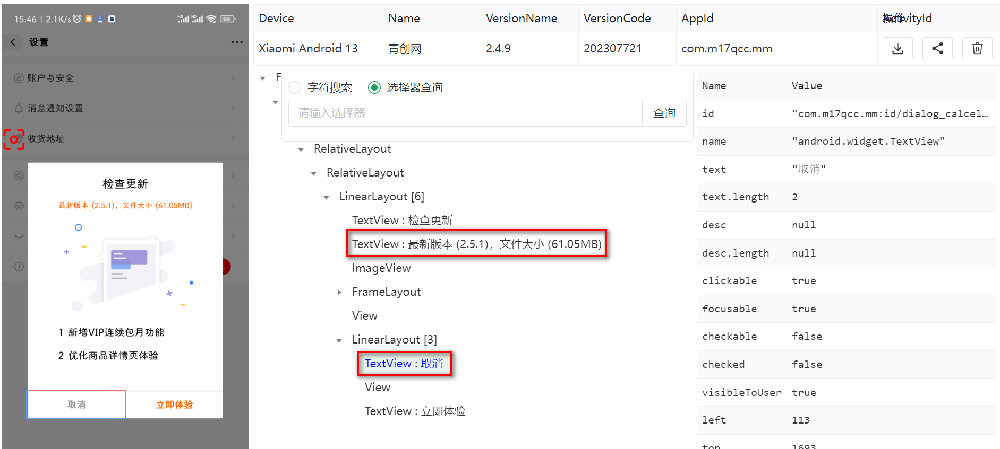

上一期，我们了解到 +，- 符号的用法，它们表示两个控件之间是兄弟关系。然而，在很多情况下，屏幕上的特征控件和目标控件之间可能会穿插其他控件，此时我们可能就需要考虑多个控件串联的情况。

以 “腾讯动漫” 的青少年模式弹窗为例，这里的目标控件是含有 “我知道了” 文字的按钮，即 TextView[text="我知道了"]，特征控件是含有 “青少年守护模式” 文字的按钮，即 TextView[text="青少年守护模式"]，可以发现，这两个控件虽然是兄弟关系，但并非紧挨着的兄弟关系，因此，在书写规则时，需要将中间控件也包含进来，这里的规则可以这样写：

TextView[text="青少年守护模式"] + TextView + View + TextView + View + TextView[text="我知道了"]

这条规则看起来比较长，但其实非常容易理解，GKD 的规则实际上是描述了一条搜索目标控件的路径。在这里，路径的起点是 TextView[text="青少年守护模式"] 控件，终点是 TextView[text="我知道了"] 控件，中间含有若干控件，且这些控件的顺序必须与规则中定义的顺序一致，GKD 尝试寻找完全匹配这条路径的控件布局，如果成功找到，就点击目标控件，在上述规则中，由于未使用 @ 符号，目标控件就是最后一个控件 TextView[text="我知道了"]。

上述青少年模式弹窗的规则只是为了演示多个控件串联的写法，实际书写规则时，TextView[text="青少年守护模式"] 和 TextView[text="我知道了"] 两个控件信息就已经足够确定一条固定的路径了，中间的控件到底是 TextView 还是 View 其实并不重要，甚至中间有几个控件我们也不关心。为了简化规则书写，上述规则可以优化为：

TextView[text="青少年守护模式"] +n TextView[text="我知道了"]

注意这里的 +n，+ 号表示左右两个控件是兄弟关系，n 表示左右两个控件的距离，如果控件距离为 3 则 n=3，如果控件距离不固定，直接写 +n 即可，GKD 会依次搜索 n=1,2,3,... 的情况。

对于 - 号，也有同样的写法，即：@TextView[text="我知道了"] -n TextView[text="青少年守护模式"]，不过个人一般习惯按照节点树从上往下书写规则。

有时候，屏幕上的特征控件和目标控件可能不是兄弟关系，它们在节点树上的位置有可能位于不同的分支下，此时仅仅依靠 +，- 号是无法描述一条完整的路径的。

以 “青创网” 的更新弹窗为例，目标控件是 TextView[text="取消"]，特征控件是 TextView[text*="新版本"]（这里 \*= 表示属性 text 的值包含字符串 “新版本”），特征控件和目标控件并不是兄弟关系，从节点树上来看，目标控件所处的位置要更深一层，表现在控件属性上就是 TextView[text="取消"] 控件的 depth 属性比 TextView[text*="新版本"] 控件的 depth 属性增加 1，为了表示控件 depth 的关系，需要引入 > 符号，这个更新弹窗的规则可以书写为：

TextView[text*="新版本"] +(n) LinearLayout > TextView[text="取消"]

这条规则中，左侧的 TextView 控件并非右侧 TextView 的直接父控件，因此需要增加右侧 TextView 的直接父控件作为额外的特征控件，这里右侧 TextView 的直接父控件是 LinearLayout 控件，它们使用 > 符号串联。左侧 TextView 控件与 LinearLayout 控件又是兄弟关系，它们之间使用 +n 串联，由此就定义了一条查找目标控件的完整路径。

类似于 + 号，如果路径上存在跨越多层的控件位置关系，可以使用 >n，例如 “快对” 的开屏广告，特征控件 FrameLayout[id="com.kuaiduizuoye.scan:id/fl_ad_container"] 与目标控件 TextView[text^="跳过"] 之间跨越了多个层级，我们不关心跨越的具体层级数量，因此使用 >n 连接这两个控件，完整规则为：

FrameLayout[id="com.kuaiduizuoye.scan:id/fl_ad_container"] >n TextView[text^="跳过"]

Tips: 实际上，为了进一步简化规则，控件的类型可以省略，上述规则优化为：

[id="com.kuaiduizuoye.scan:id/fl_ad_container"] >n [text^="跳过"]

由于未指定控件类型，上述规则可以匹配其他控件类型的类似路径，如：

FrameLayout[id="com.kuaiduizuoye.scan:id/fl_ad_container"] >n View[text^="跳过"]

LinearLayout[id="com.kuaiduizuoye.scan:id/fl_ad_container"] >n TextView[text^="跳过"]

LinearLayout[id="com.kuaiduizuoye.scan:id/fl_ad_container"] >n View[text^="跳过"]

等等。

以上就是 GKD 规则书写教程的第二期内容，主要了解了多控件串联规则的写法、跨越层级的规则写法、> 符号的用法，以及衍生的 +n、-n、>n 的用法。
